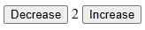

+++
title = "Web Components Part 1"
date = "2023-10-01T11:55:17+01:00"
draft = true
description = "Part 1 of exploring the current state of Web Components: defining, styling and exposing a custom element's API."


tags = []
+++

> TODO: add missing link to github repo with the full code example used by this article

Web Components are bundled with all the modern browser. They give you common APIs to define an
encapsulated HTML component without having to think about **importing a library** or
**running any build tools**.

I have split this article into three parts:

- Part 1: Defining a custom element - configuring and styling the element, exposing an API
- Part 2: Composing elements and state - building complex components, communicating between them and events.
- Part 3: Learnings and common Gotchas - things I have learned while just using the vanilla APIs

Also, I am assuming that you know a bit of React and are quite familiar with the DOM APIs.

## Why did I invest time on this?

A long time ago, back when jQuery ruled the web, I used to do more full-stack development. A lot of
it involved server-side HTML templating with some JavaScript sprinkles on top.

It wasn't ideal, especially if your web pages had a lot of interactivity and you wanted them to look
more like web applications. Things such as filtering or paginating result lists, involved a lot of
fiddling with JS and HTML.

JavaScript was a bit more immature back then (e.g. no modules/exports), and the DOM APIs were quite
minimal. You relied on jQuery to make this experience more pleasant (and perhaps slightly more
maintainable).

Fast-forward a couple of years, I decided to distance from front-end technologies.

Looking back, maybe it was because the developer experience *was not very* *inviting.* However, when
React started to become a bit more famous I decided to look into it.

Declarative rendering, the principles behind componentization, and JSX, meant that things that were
cumbersome before, became much more enjoyable and maintainable:

- You could organise the pieces of your web page as big components, built from smaller components
- You could look into a component and quickly figure out how it was going to be rendered, what
  properties it depended on, etc.

There were still some challenges:

- React was an external library
- React + JSX required a build step
- React Components were translated to plain HTML, so you lost the component's semantic context
- Fetching data, dealing with async actions or even handling forms wasn't very intuitive

Added to this, the ongoing separation between front-end and back-end meant that you could
*safely ignore* this complexity and *effectively hide* in the back-end team. All you had to do was
to make sure your API was working, and was properly documented, so to be consumed by the front-end
team.

The concept of full-stack was gone.

Many front-end frameworks spawned from the success of React, which prompted the web standards
committee to take action and fill in some gaps, much like it was done when jQuery became very popular.

## Hello Web Components!

Web Components are set of APIs that allow you to create custom HTML tags, which represent your
encapsulated and re-usable components.

The APIs have been evolving over the years, and work across modern browsers.

This means you can do something like this:

```html
<!-- A custom tag representing a counter component -->
<my-counter value="2"></my-counter>
```

And the browser knows how to render it into this:



Why is this exciting? Well, Web Components tackle some of the challenges highlighted in the previous
section:

- They are bundled with the browser
- They do not require a build step
- They preserve the semantic context, since custom elements show up in the final HTML as custom tags
- They rely on vanilla DOM APIs, so fetching data, dealing with async actions, handling forms, all
  work the way you expect it to [^1]

## Disclaimer

There are many tutorials on vanilla Web Components out there. Here are a few that I recommend looking
into, as they will have things that I will not cover here:

- [The MDN page on Web Components](https://developer.mozilla.org/en-US/docs/Web/API/Web_components)
- [javascript.info section on Web Component](https://javascript.info/web-components)

Alternatively, you also have a library like [Lit](https://lit.dev/), which builds on top of the
vanilla Web Component APIs. Lit reduces some of the boilerplate, while adding certain features that
you might be familiar with from React e.g. declarative templates, state reactivity, etc.

## Defining an element

To define a custom element you need to:

- define a class that extends `HTMLElement`
- register the new element in the browser's [`CustomElementRegistry`](https://developer.mozilla.org/en-US/docs/Web/API/CustomElementRegistry)

Here is the classic Hello World example. You can copy this into a `index.html` file and open it in
your browser to see it in action:

```html
<html>
  <head>
    <title>Hello World</title>
  <head>
  <body>
    <!-- the custom element -->
    <hello-world></hello-world>

    <!-- the custom element definition -->
    <script type="module">
      class HelloWorld extends HTMLElement {
        constructor() {
          super();
          this.innerHTML = `
            <h1>Hello World</h1>
            <p>Hello from the internet!</p>
          `;
        }
      }
      customElements.define("hello-world", HelloWorld);
    </script>
  </body>
</html>
```

There are two things to highlight here:

- You need to call `super()` in the constructor, in order to initialize the `HTMLElement` properties.
  If you forget about it, the element won't render on the page (try it!)
- You don't need to use the shadow DOM (more on this later), in order to render things inside this
  element. In this case the rendering root element is the custom element i.e. `this`

## Configuring the element

If you want to change the target of your greeting, you can declare it in as a custom attribute:

```html
<hello-world greeting-target="Luis"></hello-world>

<!-- we also want it to default to "World" if the attribute is not defined -->
<hello-world></hello-world>
```

You can change the above `constructor` into:

```js
constructor() {
  super();
  const greetingTarget = this.getAttribute("greeting-target") ?? "World";
  this.innerHTML = `
    <h1>Hello ${greetingTarget}</h1>
    <p>Hello from the internet!</p>
  `;
}
```

The custom element is an `HTMLElement` and as such, you have access to all the DOM APIs available to
an `HTMLElement` e.g. `getAttribute`, `querySelector`, etc.

## Reactivity and the element's JavaScript public API

You can configure custom elements with HTML attributes. That means we should be able to change the
configuration on-the-fly, since we can obtain a reference to our custom element and access its
JavaScript API to manipulate its attributes.

Try pasting the following snippet after the first `script` tag:

```html
<script type="module">
    const customHelloWorld = document.querySelector('hello-world');

    // this should change the greeting to "Hello Alice"
    customHelloWorld.setAttribute("greeting-target", "Alice");
</script>
```

**Nothing is happening!**

Custom elements aren't reactive by default. For example, in React you expect the component to
re-render, since the property has changed from its previous value.

In Web Components, you have to describe which attributes do you want to react to:

```js
class HelloWorld extends HTMLElement {
  // add this to make the attribute observable
  static get observedAttributes() {
    return ["greeting-target"];
  }

  // add this method
  attributeChangedCallback(name, oldValue, newValue) {
  }

// rest ommitted for brevity...
```

The method `attributeChangedCallback` will be called anytime an observed attribute changes. We can
use this to make the component re-render with the updated attribute.

Also we are currently rendering the element in the `constructor`, but the element might be created
programmatically so it would be a better idea to only render when the element gets added to the
document. That's exactly what the the `connectedCallback` is for!

Refactoring the example a bit:

```js
// since we aren't doing anything special here
// you could also remove this
constructor() {
  super();
}

connectedCallback() {
  // rendering is now called when this element is added to the document
  this.#render({
    greetingTarget: this.getAttribute("greeting-target") ?? "World",
  });
}

attributeChangedCallback(name, _oldValue, newValue) {
  if (name === "greeting-target") {
    // it is also called whenever the attribute changes
    this.#render({ greetingTarget: newValue ?? "World" });
  }
}

// extract the rendering to a private method
#render({ greetingTarget }) {
  this.innerHTML = `
    <h1>Hello ${greetingTarget}</h1>
    <p>Hello from the internet!</p>
  `;
}
```

Try to refresh the page, you'll see that it now greets Alice. If you open the JS console on that
page and paste the following snippet, the greeting should react and change to Bob.

```js
document.querySelector("hello-world").setAttribute("greeting-target", "Bob");
```

We can improve the `HelloWorld` component's JavaScript API by exposing the attribute as a property.

```js
class HelloWorld extends HTMLElement {

  get greetingTarget() {
    return this.getAttribute("greeting-target") ?? "World";
  }

  set greetingTarget(value) {
    if (value && value !== "") {
      return this.setAttribute("greeting-target", value);
    } else {
      return this.removeAttribute("greeting-target");
    }
  }
  // rest ommitted for brevity...
}
```

And the above snippet that causes the greeting to change, then becomes:

```js
document.querySelector("hello-world").greetingTarget = "Bob";
```

## Styling the element

By default, you can style the custom element as you would any other element (including its children).
Try adding this fancy style to the `head` tag:

```html
<style>
  hello-world {
    display: block;
    font-size: 1em;
    font-family: sans-serif;
    color: rgb(55, 53, 47);
    border-inline-start: 0.2em solid rgb(4, 107, 39);
    padding-inline-start: 1em;
  }

  hello-world > h1 {
    font-family: monospace;
    text-transform: uppercase;
  }
</style>
```

The `<hello-world>` element and its children will now have a different style than the other elements
on the page.

However, there are times were you might want to offer a *styled component* to your consumers. Also,
you don't want the style of your custom element to affect other elements in your page. Fortunately,
there is a way to achieve this encapsulation: the shadow DOM.

> The shadow DOM provides a way to add a separate isolated and encapsulated DOM tree to an element

Here's how we can achieve this:

```js
constructor() {
  super();
  // attach the isolated DOM tree on this element
  this.attachShadow({ mode: "open" });
}

#render({ greetingTarget }) {
  // now you can declare styles inline and they won't
  // affect the rest of the page
  // NOTE: we are now rendering against the shadowRoot
  // and not this element
  this.shadowRoot.innerHTML = `
    <style>
      :host {
        display: block;
        font-size: 1em;
        font-family: sans-serif;
        color: rgb(55, 53, 47);
        border-inline-start: 0.2em solid rgb(4, 107, 39);
        padding-inline-start: 1em;
      }
      h1 {
        font-family: monospace;
        text-transform: uppercase;
      }
    </style>
    <h1>Hello ${greetingTarget}</h1>
    <p>Hello from the internet!</p>
  `;
}
```

Don't forget to also remove the `style` tag we have added to the `head` section of our HTML document.

Even though we have a rule in our custom element that affects all `h1` tags, that does not affect
anything outside of our custom element:

```html
<body>
  <!-- the custom element -->
  <hello-world greeting-target="Luis"></hello-world>

  <!-- this element will use the default stylesheet -->
  <h1>Another h1 using default styling</h1>
```

# Wrapping up

So for this part 1, we have learned how to declare a custom element. Custom elements encapsulate
both rendering and functionality of your custom components.

We have also learned how to declare and configure the custom element. Custom elements are configured
through HTML attributes.

Because custom elements are also JavaScript classes, you can enrich their public API, so they are
easier to consume from other components or scripts.

Custom elements (and their children) can be styled through CSS, just like any other HTML element.
If you wish to enforce a style on your elements, but you do not want those styles to influence the
other elements on the page, you should attach a shadow DOM node to your element.

Next time, we will explore how to build complex components  and how to communicate using DOM events.

[^1]: To be fair on React, Web Components do not dictate a particular rendering process, so you can
      choose to be declarative or imperative, making these actions more intuitive than solving them
      while using React.
