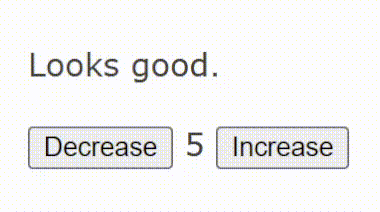

+++
title = "Web Components Part 2"
date = "2023-10-05T16:47:04+01:00"
draft = false
description = "Part 2 of exploring the current state of Web Components: building complex components, communicating between using events"

tags = []
+++

> You can find the full examples used in this blog series [on Github](https://github.com/lpedrosa/webcomponents-blog-examples)

This is part 2 of my Web Components series:

- [Part 1: Defining a custom element - configuring and styling the element, exposing an API]()
- Part 2: Composing elements and state - building complex components, communicating between using events.
- Part 3: Learnings and common Gotchas - things I have learned while just using the vanilla APIs

In the last article we went through how to declare a Custom Element, how to configure the element
through HTML attributes and how to style the element.

This time, we will start by adding some interactivity and state to a component.

## Revisiting `<my-counter>`

The previous post starts by showing that you can [define a counter component](), but it does not explain how to implement it. If we
use what we have learned before, we'll come up with something like this:

```js
class MyCounter extends HTMLElement {
  static get observedAttributes() {
    return ["value"];
  }

  constructor() {
    super();
    this.attachShadow({ mode: "open" });
  }

  connectedCallback() {
    this.#render({ counterValue: this.value });
  }

  attributeChangedCallback(_name, _oldValue, _newValue) {
    this.#render({ counterValue: this.value });
  }

  get value() {
    const n = Number.parseInt(this.getAttribute("value"), 10);
    return Number.isNaN(n) ? 0 : n;
  }

  set value(v) {
    const n = Number.parseInt(v, 10);
    this.setAttribute("value", Number.isNaN(n) ? 0 : n);
  }

  #render({ counterValue }) {
    this.shadowRoot.innerHTML = `
      <button id="decrease" type="button">Decrease</button>
      <span>${counterValue}</span>
      <button id="increase" type="button">Increase</button>
    `;
  }
}

customElements.define("my-counter", MyCounter);
```

You can then declare the component in your html, with a starting value:

```html
<my-counter value="2"></my-counter>
```

If you change the `value` attribute (either in the browser developer tools or through javascript),
the counter value will react accordingly and will change the rendered value.

```js
// with the browser developer tools console open
const myCounter = document.querySelector("my-counter");
myCounter.value = 5;

// the counter now renders 5 instead of 2 (the prvious starting value)
```

## Responding to input

The counter has two buttons but they don't do much. We can make them work by attaching an event
listener function for the `click` event.

> But where should I do this?

Considering this custom element re-renders the entire component when the `value` attribute changes,
you should do it at the end of the render function.

```js
#render({counterValue}) {
  this.shadowRoot.innerHTML = // ...ommitted

  this.shadowRoot
    .getElementById("decrease")
    .addEventListener("click", (_event) => {
      this.value = this.value - 1;
    });
  this.shadowRoot
    .getElementById("increase")
    .addEventListener("click", (_event) => {
      this.value = this.value + 1;
    });
}
```

If you refresh the page and click the buttons, they will now increment and decrement the counter
value accordingly.

## Composing custom components

Now that we have a working counter component, we can use it for building other components.

For this example, we want to build a _counter reaction_ component, which will display a message
based on the value of our counter:

- if our counter goes above 10 it will display _It's way to high!_
- if our counter goes below 1 it will display _Now it's too low!_

Here is a skeleton implementation:

```js
import "./my-counter.js";

const ReactionStates = Object.freeze({
  Low: { message: "Now it's too low!" },
  Normal: { message: "Looks good." },
  High: { message: "It's way to high" },
});

class CounterReaction extends HTMLElement {
  #reactionState;
  #counterValue;

  constructor() {
    super();
    this.attachShadow({ mode: "open" });
    this.#reactionState = ReactionStates.Normal;
    this.#counterValue = 5;
  }

  connectedCallback() {
    this.#render({
      reactionMessage: this.#reactionState.message,
      counterValue: this.#counterValue,
    });
  }

  #render({ reactionMessage, counterValue }) {
    this.shadowRoot.innerHTML = `
      <p>${reactionMessage}</p>
      <my-counter value=${counterValue}></my-counter>
    `;
  }
}

customElements.define("counter-reaction", CounterReaction);
```

We import our `my-counter` component and initialize the `CounterReaction` internal state. We want
the reaction component to start with a normal reaction and the value 5, which is somewhere in the
middle of our reaction scale.

If you try to declare our `<counter-reaction>` component in the page it will look okay, but the
reaction message is not changing when the counter changes.

## Communicating between components

Our `<counter-reaction>` component can set the value of our `<my-counter>` component, since it is
part of counter's public API and it is exposed as an attribute.

However, the reaction component would like to know when counter value changes, so it can render the
appropriate reaction message.

We can achieve by leveraging the [DOM event model](https://developer.mozilla.org/en-US/docs/Learn/JavaScript/Building_blocks/Events).
If our counter fires an event when its value changes, the reaction component can then _react to that
event_ and render the correct reaction message.

If we change our `<my-counter>` component to fire an event called `my-counter:change` and set the
content of that event to be the new counter value:

```js
// in my-counter.js

this.shadowRoot
  .getElementById("decrease")
  .addEventListener("click", (_event) => {
    this.value = this.value - 1;

    // fire an event when the value change
    this.dispatchEvent(
      new CustomEvent("my-counter:change", {
        bubbles: true,
        // also bubble up the shadow DOM
        composed: true,
        detail: { newValue: this.value },
      })
    );
  });
this.shadowRoot
  .getElementById("increase")
  .addEventListener("click", (_event) => {
    this.value = this.value + 1;

    // here as well
    this.dispatchEvent(
      new CustomEvent("my-counter:change", {
        bubbles: true,
        composed: true,
        detail: { newValue: this.value },
      })
    );
  });
```

Then our reaction component can listen to the change event and act accordingly:

```js
// in counter-reaction.js

// helper to signal we are updating the component
#update() {
  this.#render({
    reactionMessage: this.#reactionState.message,
    counterValue: this.#counterValue,
  });
}

connectedCallback() {
  this.#update();

  // listen to counter changes
  this.addEventListener("my-counter:change", (event) => {
    const counterValue = event.detail.newValue;

    if (counterValue > 10) {
      this.#reactionState = ReactionState.High;
      this.#counterValue = counterValue;
      this.#update();
    } else if (counterValue < 1) {
      this.#reactionState = ReactionState.Low;
      this.#counterValue = counterValue;
      this.#update();
    } else {
      this.#reactionState = ReactionState.Normal;
      this.#counterValue = counterValue;
      this.#update();
    }
  });
}
```



## Wrapping up

For part 2, we used the learnings from part 1 to build an element that reacts user to input. In a
custom element, you can add event listeners just like in plain vanilla JavaScript.

We then used this element to build a more complex element. The new element (the parent), was composed
by an instance of our `<my-counter>` element (the child).

In order to communicate between these elements, we dispatch a custom event from our child element.
The parent element can then listen to that event and react accordingly.

Next time, we will explore some gotchas and things I have learned when building custom elements while
only using the vanilla APIs.
